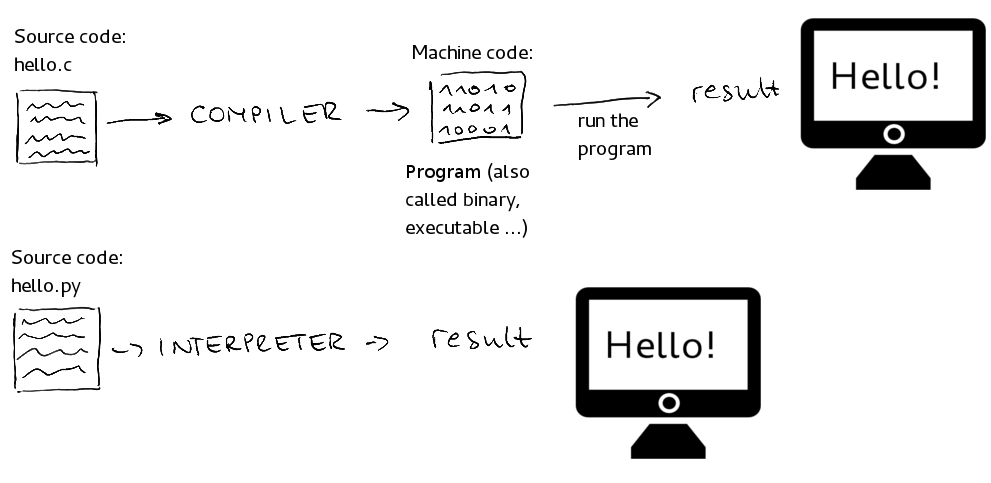

<h1 align="center"> Logic Programming </h1>

# Content

1. [Project Status](#projectstatus)
2. [About the Project](#abouttheproject)
3. [Project Description](#projectdescription)
4. [Chapter 1: Introduction](#chapter1)
    - [Chapter 1 - Part 1: A Global View](#chapter1part1)
5. [Chapter 2: What is a Computer?](#chapter2)
    - [Chapter 2 - Part 1: A Simple Definition](#chapter2part1)
    - [Chapter 2 - Part 2: How Does it Work](#chapter2part2)
    - [Chapter 2 - Part 3: Inside a Computer](#chapter2part3)
6. [Chapter 1: Introduction](#chapter1)
    - [Chapter 1 - Part 1: Algorithms](#chapter1part1)
    - [Chapter 1 - Part 2: Automation](#chapter1part2)
    - [Chapter 1 - Part 3: What are Computers](#chapter1part3)
7. [Chapter 2: Programming Language](#chapter2)
    - [Chapter 2 - Part 1: Low-Level vs. High-Level](#chapter2part1)
    - [Chapter 2 - Part 2: Lexical Rules and Syntax Rules](#chapter2part2)
8. [Chapter 3: IDE](#chapter3)
    - [Chapter 3 - Part 1: IDE](#chapter3part1)
9. [Chapter 4: Compiler and Interpreter](#chapter4)
    - [Chapter 4 - Part 1: Source Code](#chapter4part1)
    - [Chapter 4 - Part 2: Compilation](#chapter4part2)
    - [Chapter 4 - Part 3: Compiled Languages vs Interpreted Languages](#chapter4part3)
    - [Chapter 4 - Part 4: Hybrid Languages](#chapter4part4)
10. [Chapter 5: What Programming Language Choose?](#chapter5)
    - [Chapter 5 - Part 1: Choose Your Path](#chapter5part1)
    - [Chapter 5 - Part 2: Next Step](#chapter5part2)
11. [Usage](#usage)
12. [Contributors](#contributors)
13. [Contributing](#contributing)
14. [Roadmap](#roadmap)
15. [To Do](#todo)
16. [Contacts](#contacts)
17. [License](#license)

# Project Status <a name="projectstatus"></a>

Project Status: Under Development :warning:

# About the Project <a name="abouttheproject"></a>

Many curious people like me have already asked themselves: How does a computer work?

The purpose of this tutorial is to serve as a base for anyone who wants to dive, or just get to know, the wonderful world of programming, even if they know little or nothing about the subject.

This project is a part of a big project with basic concepts in computer science. Go to my [GitHub profile][github-url] to see more projects.

This project makes a introduce to programming logic. Read this tutorial first, choose a programming language and go to these repositories according to the choose programming language:

- [C][c-url]
- [C++][cpp-url]
- [C#][csharp-url]
- [Java][java-url]
- [Python][python-url]
- [JavaScript][javascript-url]
- [PHP][php-url]
- [TypeScript][typescript-url]
- [MATLAB][matlab-url]
- [R][r-url]

[![Project][project-shield]][project-url] <!-- Put the link of the github page of the tutorial her -->

This tutorial was based in the course from Phd Professor [Nelio Alves - Algorithms and Programming Logical][logicalcourse-url], the Youtube Channel [DevSuperior][devsuperior-url] and the WikiBook [Introduction to Programming][program-introduction-url].

# Project Description <a name="projectdescription"></a>

Logical Programming is the first step in the computer science course and the first skill to learn when you want to become a software developer.

Logical Programming must be independent of what programming language you will use because the logic always will be the same.

The basic content of a programming logic course consists:

- Introduction: Algorithms, Programming Language, IDE, Compiler and Interpreter.
- Sequential Structures: Arithmetic Expressions, Variables, Data Input, Data Processing, Data Output and Mathematical Functions.
- Conditional Structures: Comparable Expressions, Logical Expressions, Simple Conditional Structure, Compound Conditional Structure and Chaining Conditional Structures.
- Repetitive Structures: While Repetitive Structure and For Repetitive Structure.
- Vectors: Theory, Declaration and Creation and Access.
- Matrices: Theory, Declaration, Creation and Access.

## <a name="chapter1"></a>Chapter 1: Introduction

#### <a name="chapter1part1"></a>Chapter 1 - Part 1: A Global View

Nowadays, not knowing how to work with computers is considered illiteracy (illiteracy) and the custom for not knowing how to use a computer can be expensive.

When we use computers, we can do many things. A child can use the Internet to send a message, a student can use a spreadsheet to calculate an average or how many points he needs to pass each subject, a cook can save his recipes in software such as Word or in a specialized product for recipes. In fact, the number of specialized products is so great that, if you look carefully, you will certainly find a program that does something very close to what you want.

<br>

<div align="center"><br><sub>Fig 1 - A Computer Multitask - (<a href='https://www.freepik.com/vectors/people'>People vector created by Freepik - https://www.freepik.com</a>) </sub></div>

<br>

The problem is that sometimes we want to do something specific: we want a computer program that does something that will serve us or our company in a unique way. In that case, instead of buying a ready-made program we must develop our own program. For that, it is necessary to master a new way of manipulating the computer: programming. 

<br>

<div align="center"><br><sub>Fig 2 - Programming - (<a href='https://www.freepik.com/vectors/work'>Work vector created by stories - www.freepik.com</a>) </sub></div>

<br>

Our motive may be a business, a schoolwork, a hobby or mere curiosity. Nowadays, programming a computer can be done in several ways. You can, for example, slightly modify the behavior of applications using macros, as is allowed in programs such as Microsoft Word. You can make even more serious modifications using built-in languages, as can also be done in Microsoft Office programs or even in computer games like Neverwinter Nights. You can also take an existing open-source program, or free software, and modify it. Or you can start from the beginning and program just about everything, certainly with the help of ready-made libraries that are part of the job.

To program you have many options: packages that can be extended with built-in macros or languages, point-and-click programming environments, languages that are easier to learn and languages that are more difficult, but which have great power or features suitable for large systems. In any case, the spirit behind it is the same: **programming is giving orders to the computer, showing how it should react to the user and how it should process the available data.**

<br>

<div align="center"><br><sub>Fig 3 - A Example of JavaScript Code, or, a Order to Computer - (<a href='https://unsplash.com/photos/pgSkeh0yl8o?utm_source=unsplash&utm_medium=referral&utm_content=creditShareLink'>Work created by Christopher Robin Ebbinghaus</a>) </sub></div>

<br>

There is virtually no limit to what you can do with a computer. Computers help people to talk, control devices, and have taken man to the moon in many ways. Even the most difficult things, like simulating a feeling or intelligence, are studied hard all over the world. Some problems are very big and require the construction of huge computers. Others are so simple that we can solve them on simple computers, which are inside equipment. The notion of the powerful also changes over time: a chip that was used in personal computers in 1988, the w: Z80, is now used in devices such as faxes.

Today it is difficult to imagine a domain of human activity where the use of computers is not desirable. Thus, the domain of programming is substantially dictated by imagination and creativity. We can say that the great advantage of knowing how to program is the possibility to create what you want, when you want. Not only for the PC, but cell phones, PDAs, among others. Of course it requires a little effort, but for many that effort is actually a challenge whose reward is to see your idea turned into reality.

## <a name="chapter2"></a>Chapter 2: What is a Computer?

#### <a name="chapter2part1"></a>Chapter 2 - Part 1: A Simple Definition

A computer is a machine that can be programmed to carry out sequences of arithmetic or logical operations automatically. Modern computers can perform generic sets of operations known as programs. These programs enable computers to perform a wide range of tasks.

Basic, a computer is a programable, electronic device that accepts data, performs operations, presents the results, and store the data or results.

- **Input**: Entering data into the computer
- **Processing**: Performing operations on the data
- **Output**: Presenting the results
- **Storage**: Saving Data, programs, or output for future use

<br>

<div align="center"><br><sub>Fig 4 - What is a Computer - (<a href='https://slideplayer.com/user/5454922/'>Work by Clementine Patrick</a>) </sub></div>

<br>

#### <a name="chapter2part2"></a>Chapter 2 - Part 2: How Does it Work

Electricity drives computers and inside him, there are electronic signals. A computer system can understand and execute only program instructions in binary or in simple terms, signs "1” and "0".

Signs of "1” and "0" can understand as ON and OFF, or, in Digital Electronic, with electric current or not.

A transistor is a little device that either allows the electrons through or it doesn’t; it is either ON or OFF, AKA a 1 or 0.

<br>

<div align="center"><br><sub>Fig 5 - A Transistor - (<a href='https://www.lmeservices.com/how-do-computers-work-short-answer/'>Work by Hardware</a>) </sub></div>

<br>

In mathematics, a binary number is used to represent any number using only two numerical numbers that is 0 and 1, and therefore, the binary number system is said be a base 2 number system.

That 1 or 0 (also know as Binary Code) ON or OFF, created by transistor is the basis of all computer coding.  Computer’s take these billions of 1’s and 0’s and interpret them however we tell them to.

<br>

<div align="center"><br><sub>Fig 6 - Convert text into binary - (<a href='https://www.computerhope.com/issues/ch001632.htm'>Work by Computer Hope</a>) </sub></div>

<br>

<div align="center"><br><sub>Fig 7 - Convert colour into binary - (<a href='http://www.cs.ucc.ie/~gavin/cs1050/the_internet/slides/ch07s01s02.html.htm'>Work by School of Computer Science of University College Cork</a>) </sub></div>

<br>

<div align="center"><br><sub>Fig 8 - Convert bilevel image into binary - (<a href='http://matlab.izmiran.ru/help/toolbox/images/intro4.html'>Work by The MathWorks</a>) </sub></div>

<br>

The programs which interpret binary code have gotten progressively smarter and have multiple layers (or OSI’s) but at their core, all they are doing is using billions of transistors which are simply ON or OFF and interpreting those 1’s and 0’s in whatever preset way you’ve dictated via your computer code

A dumb example, just to simplify:

- **100101101** – Start Microsoft Word

- **001101010** – Close Microsoft Word


#### <a name="chapter2part3"></a>Chapter 2 - Part 3: Inside a Computer

## <a name="chapter1"></a>Chapter 1: Introduction

#### <a name="chapter1part1"></a>Chapter 1 - Part 1: Algorithms

In essence, algorithms are simply a series of instructions that are followed, step by step, to do something useful or solve a problem. You could consider a cake recipe an algorithm for making a cake, for example.

Example of a cake recipe algorithm:

1.	Preheat the oven.
2.	Gather the ingredients.
3.	Measure out the ingredients.
4.	Mix the ingredients to make the batter.
5.	Grease a pan.
6.	Pour the batter into the pan.
7.	Put the pan in the oven.
8.	Set a timer.
9.	When the timer goes off, take the pan out of the oven.
10.	Enjoy!

In Mathematics and Computer Science, an algorithm is any well-defined computational procedure that takes some value, or set of values, as input and produces some value, or set of values, as output. An algorithm is thus a sequence of computational steps that transform the input into the output [THOMAS C. CORMEN][cormen-url].

Example of a bubble sort algorithm:

1. Enter a unsorted array of 5 integer elements. (Input)
2. Start with the first two elements and sort them in ascending order. (Compare the element to check which one is greater). (processing)
3. Compare the second and third element to check which one is greater, and sort them in ascending order. (processing)
4. Compare the third and fourth element to check which one is greater, and sort them in ascending order. (processing)
5. Compare the fourth and fifth element to check which one is greater, and sort them in ascending order. (processing)
6. Repeat steps 1–5 until no more swaps are required. (processing)
7. Show in the screen the sorted array (Output)

<br>

<div align="center"><br><sub>Fig 1 - Bubble Sort Algorithm Working (https://gaebster.ch/bubblesort/) </sub></div>

<br>

#### <a name="chapter1part2"></a>Chapter 1 - Part 2: Automation

Automation describes a wide range of technologies that reduce human intervention in processes. 

In the example of the algorithm to make a cake, we can automation the process with a machine that is capable to do everything or a part of it...

<br>

<div align="center"><br><sub>Fig 2 - Automation the Cake Recipe Algorithm (http://www.trickartt.com/notes/tag/fabrik/)</sub></div>

<br>

The automation machine that is capable to automate the bubble sort algorithm is the computer.

#### <a name="chapter1part3"></a>Chapter 1 - Part 3: What are Computers

A machine that is capable to automate calculus algorithms. Usually, it represents a computer in an abstract form by a very simple diagram showing a processing unit capable of using data that comes from or must be stored both in memory and in input and output devices:

<br>

<div align="center"><br><sub>Fig 3 - Basic Computer Diagram Von Neumann (https://pt.wikibooks.org/wiki/Introdu%C3%A7%C3%A3o_%C3%A0_programa%C3%A7%C3%A3o/Como_programar)</sub></div>

<br>

A computer has Hardware (Physical parts - machine): 

<br>

<div align="center"><br><sub>Fig 4 - Computer Hardware (https://farsamoyaqaan.com/primary-parts-of-a-computer/)</sub></div>

<br>

And a Software (Logical parts - Programs):

<br>

<div align="center"><br><sub>Fig 5 - Computer Softwares (https://bcastudyguide.wordpress.com/unit-1-introduction-of-os/)</sub></div>

<br>

Computer programs is algorithms executed by the computer. For this, hardware and software work together to get the input of the user, process through software and hardware and output the result in screen.

To make a Computer Program we need four things:

- **Programming language:** Lexical and syntactic rules for writing the program.

- **IDE:** Software to edit and test the program.

- **Compiler**: Transform the source code into object code.

- **Code generator or virtual machine**: Software that allows the program to run.

The Bubble Algorithm can be automatizing with the C program Language. Bellow, there is the source code of the program:

```c
#include <stdio.h>
void bubble_sort(int a[], int n) {
    int i = 0, j = 0, tmp;
    for (i = 0; i < n; i++) {   // loop n times - 1 per element
        for (j = 0; j < n - i - 1; j++) { // last i elements are sorted already
            if (a[j] > a[j + 1]) {  // swop if order is broken
                tmp = a[j];
                a[j] = a[j + 1];
                a[j + 1] = tmp;
            }
        }
    }
}
int main() {
  int a[100], n, i, d, swap;
  printf("Enter number of elements in the array:\n");
  scanf("%d", &n); 
  printf("Enter %d integers\n", n);
  for (i = 0; i < n; i++)
    scanf("%d", &a[i]);
  bubble_sort(a, n);
  printf("Printing the sorted array:\n");
  for (i = 0; i < n; i++)
     printf("%d\n", a[i]);
  return 0;
}
```

## <a name="chapter2"></a>Chapter 2: Programming Language

#### <a name="chapter2part1"></a>Chapter 2 - Part 1: Low-Level vs. High-Level

Programming languages are the tools we use to write instructions for computers to follow. 

Computers “think” in binary — strings of 1s and 0s. Programming languages allow us to translate the 1s and 0s into something that humans can understand and write. A programming language is made up of a series of symbols that serves as a bridge that allow humans to translate our thoughts into instructions computers can understand.

Programming languages fall into two different classifications — low-level and high-level.

Low-level programming languages are closer to machine code, or binary. Therefore, they are more difficult for humans to read (although they are still easier to understand than 1s and 0s). The benefit of low-level languages is that they are fast and offer precise control over how the computer will function.

High-level programming languages are closer to how humans communicate. High-level languages use words (like object, order, run, class, request, etc.) that are closer to the words we use in our everyday lives. This means they are easier to program in than low-level programming languages, although they do take more time to translate into machine code for the computer.

#### <a name="chapter2part2"></a>Chapter 2 - Part 2: Lexical Rules and Syntax Rules

Programming languages have a lexical rules (orthography) and syntax rules (grammar) to write programs.

- Lexical

    Is about the correct words orthography.
    
    | Example English                                 | Example Programming Language  |
    |:------------------------------------------------|:------------------------------|
    | Dog (Correct)                                   | Main (Correct)                |
    | Dogo (Wrong)                                    | Maim (Wrong)                  |
    
- Syntax

   Is about the correct sentence’s grammar.
   
    | Example English                                 | Example Programming Language       |
    |:------------------------------------------------|:-----------------------------------|
    | He is a Daniel in judgment (Correct)            | x = 2 + y (Correct)                |
    | Daniel is a He in judgment (Wrong)              | x = + 2 y (Wrong)                  |
    

## <a name="chapter3"></a>Chapter 3: IDE

#### <a name="chapter3part1"></a>Chapter 3 - Part 1: IDE

An integrated development environment (IDE) is a software application that provides comprehensive facilities to computer programmers for software development. An IDE normally consists of at least a source code editor, build automation tools and a debugger.

## <a name="chapter4"></a>Chapter 4: Compiler and Interpreter

#### <a name="chapter4part1"></a>Chapter 4 - Part 1: Source Code

In computing, source code is any collection of code, with or without comments, written using a human-readable programming language, usually as plain text. 

The source code of a program is specially designed to facilitate the work of computer programmers, who specify the actions to be performed by a computer mostly by writing source code.

<br>

<div align="center"><br><sub>Fig 6 - Source Code Example - Java vs Python (https://belitsoft.com/java-development-services/java-vs-python-tried-and-true-vs-modern-and-new)</sub></div>

<br>

To computer understand the source code, this code must be assembler or compiler into binary machine code that can be executed by the computer.

#### <a name="chapter4part2"></a>Chapter 4 - Part 2: Compilation

Compilation is the process the computer takes to convert a high-level programming language into a machine language that the computer can understand. The software which performs this conversion is called a compiler.

<br>

<div align="center"><br><sub>Fig 7 - Compiler Process (https://www.guru99.com/compiler-design-phases-of-compiler.html)</sub></div>

<br>

#### <a name="chapter4part3"></a>Chapter 4 - Part 3: Compiled Languages vs Interpreted Languages

Compiled languages are converted directly into machine native code by a compiler program. They require an explicit build step before execution. That is why we need to rebuild the program every time we make a code change. Compiled languages tend to be faster and more efficient than interpreted languages. However, their generated machine code is platform specific.

On the other hand, in interpreted languages there are no build steps. Instead, interpreters operate on the source code of the program while executing. Interpreted languages were once considered significantly slower than compiled languages.

<br>

<div align="center"><br><sub>Fig 8 - Compiled Vs Interpreted (https://medium.com/from-the-scratch/stop-it-there-are-no-compiled-and-interpreted-languages-512f84756664)</sub></div>

<br>

- Example of Compiled Languages:
    - C
    - C++

- Example of Interpreted Languages:
    - PHP
    - JavaScript
    - Ruby
    - Python

#### <a name="chapter4part4"></a>Chapter 4 - Part 4: Chapter 4 - Part 4: Hybrid Languages

Hybrid compiler is a compiler which translates a human readable source code to an intermediate byte code for later interpretation. So, these languages do have both features of a compiler and an interpreter. These types of compilers are commonly known as Just In-time Compilers (JIT).

Java is one good example for these types of compilers.

<br>

<div align="center"><br><sub>Fig 9 - Hybrid Language (https://techvidvan.com/tutorials/features-of-java-programming-language/)</sub></div>

<br>

- Example of Hybrid Languages:
    - Java (Virtual Machine: JVM)
    - C# (Virtual Machine: Microsoft .NET Framework)

## <a name="chapter5"></a>Chapter 5: What Programming Language Choose?

#### <a name="chapter5part1"></a>Chapter 5 - Part 1: Choose Your Path

<br>

<div align="center"><br><sub>Fig 10 - Choose Your Path (https://buggyprogrammer.com/blogs/first-programming-language/)</sub></div>

<br>

#### <a name="chapter5part2"></a>Chapter 5 - Part 2: Next Step

I elaborated some tutorial for some programming languages, approaching just the logic programming concepts of the language (Sequential Structures, Conditional Structures, Repetitive Structures, Vectors and Matrices).

- [C][c-url]
- [C++][cpp-url]
- [C#][csharp-url]
- [Java][java-url]
- [Python][python-url]
- [JavaScript][javascript-url]
- [MATLAB][matlab-url]

# Usage <a name="usage"></a>

Using this like a bibliography if you want to remember logic programming concepts.

# Contributors <a name="contributors"></a>

| [ <br> <sub> Vitor Garcia </sub>][github-url] | 
| :-----------------------------------------------------------------------------------------------------: |

# Contributing <a name="contributing"></a>

Contributions are what make the open source community such an amazing place to be learn, inspire, and create. Any contributions you make are **greatly appreciated**.

1. Fork the Project
2. Create your Feature Branch (`git checkout -b feature/AmazingFeature`)
3. Commit your Changes (`git commit -m 'Add some AmazingFeature'`)
4. Push to the Branch (`git push origin feature/AmazingFeature`)
5. Open a Pull Request

# Roadmap <a name="roadmap"></a>

See the [![Issues][issues-shield]][issues-url]  for a list of proposed features (and known issues).

# To Do <a name="todo"></a>

Project Completed

# Contacts <a name="contacts"></a>

| Vitor Garcia                                     |
| :----------------------------------------------- |
| [![LinkedIn][linkedin-shield]][linkedin-url]     |
| [![Portfolio][portfolio-shield]][portfolio-url]  |
| [![GitHub][github-shield]][github-url]           |

# License <a name="License"></a>

- [![MIT License][license-shield]][license-url]

- Distributed under the MIT License. See `LICENSE` for more information.


<!-- README TUTORIALS -->

<!--

https://dev.to/reginadiana/como-escrever-um-readme-md-sensacional-no-github-4509

-->

<!-- 

Mark Down Guide - Readme Text Format Style

https://www.markdownguide.org/

-->

<!-- 

How to Create your Badges

https://gist.github.com/rupeshtiwari/8558ca0d8ec1c15619e4492dcd6aa81a

-->

<!-- USEFUL LINKS -->

<!--

Free Images Without Copyright

https://unsplash.com/


-->

<!-- MY BADGES -->

[project-shield]: https://img.shields.io/badge/link-project-green.svg
[project-url]: https://github.com/vitorstabile/logic-programming-basics
[linkedin-shield]: https://img.shields.io/badge/my-linkedin-blue.svg 
[linkedin-url]: https://www.linkedin.com/in/vitor-garcia-5b151b67/
[portfolio-shield]: https://img.shields.io/badge/my-portfolio-red.svg
[portfolio-url]: https://vitorstabile.github.io
[github-shield]: https://img.shields.io/badge/my-github-green.svg
[github-url]: https://github.com/vitorstabile
[issues-shield]: https://img.shields.io/badge/link-issues-green.svg
[issues-url]: https://github.com/vitorstabile/logic-programming-basics/issues
[license-shield]: https://img.shields.io/badge/license-mit-blue.svg 
[license-url]: https://github.com/vitorstabile/logic-programming-basics/blob/main/LICENSE.txt
[c-url]: https://github.com/vitorstabile/logic-programming-with-c-basics
[cpp-url]: https://github.com/vitorstabile/logic-programming-with-cpp-basics
[csharp-url]: https://github.com/vitorstabile/logic-programming-with-csharp-basics
[java-url]: https://github.com/vitorstabile/logic-programming-with-java-basics
[python-url]: https://github.com/vitorstabile/logic-programming-with-python-basics
[javascript-url]: https://github.com/vitorstabile/logic-programming-with-javascript-basics
[php-url]: https://github.com/vitorstabile/logic-programming-with-php-basics
[typescript-url]: https://github.com/vitorstabile/logic-programming-with-typescript-basics
[matlab-url]: https://github.com/vitorstabile/logic-programming-with-matlab-basics
[r-url]: https://github.com/vitorstabile/logic-programming-with-r-basics
[logicalcourse-url]: https://www.udemy.com/course/curso-algoritmos-logica-de-programacao/
[devsuperior-url]: https://www.youtube.com/watch?v=PfYifUFmXk8
[program-introduction-url]: https://pt.wikibooks.org/wiki/Introdu%C3%A7%C3%A3o_%C3%A0_programa%C3%A7%C3%A3o
[cormen-url]: https://www.amazon.com/Introduction-Algorithms-third-Thomas-Cormen-ebook/dp/B08FH8N996
